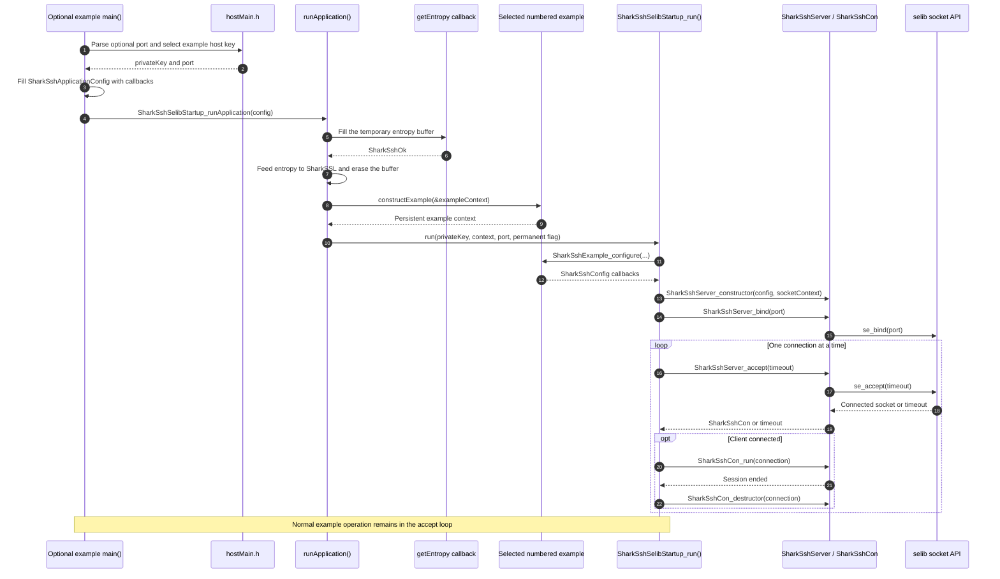
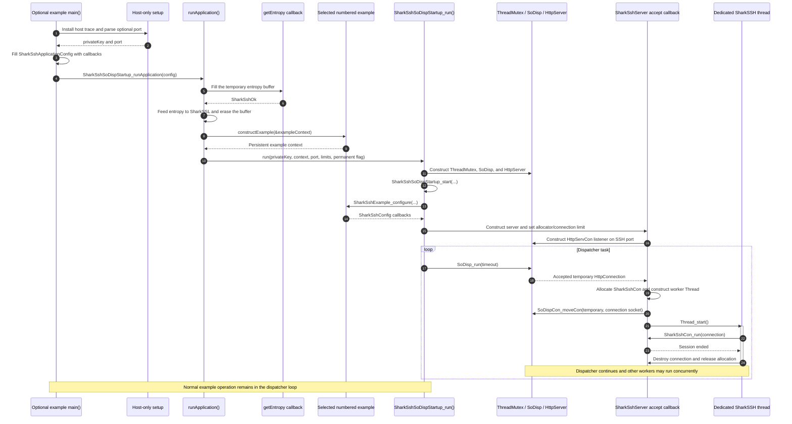

# SharkSSH examples

The release examples take you from one fixed SSH command to a shell and Secure
File Transfer Protocol (SFTP) service backed by a real filesystem. Start with
the smallest example that proves the feature your product needs:

| Example | Shell | Filesystem | SFTP | Storage adapter |
| --- | ---: | ---: | ---: | --- |
| [01 minimal](01-minimal/README.md) | No | No | No | None |
| [02 shell](02-shell/README.md) | Yes | No | No | None |
| [03 SFTP](03-sftp/README.md) | Yes | Yes | Yes | Windows/POSIX/ESP-IDF virtual filesystem |
| [04 BAS SFTP](04-bas-sftp/README.md) | Yes | Yes | Yes | Barracuda `IoIntf` |

For the fastest host test, choose a row, then open the
[Visual C++](build/VC-Win/README.md) or
[POSIX](build/POSIX/README.md) build guide. Build the matching `selib` or
SoDisp target, run it on port 2222, and connect with the published
`testuser` / `test-password` account. Use a dedicated test directory for
examples 03 and 04 because they expose their working directory.

Ready-to-configure builds are provided for
[Visual C++](build/VC-Win/README.md), [POSIX](build/POSIX/README.md), and
[ESP-IDF](build/ESP32/README.md). Visual C++ and POSIX provide the complete
seven-build matrix. The ESP-IDF directory intentionally contains only example
03 with [`selib`](https://realtimelogic.com/ba/doc/en/C/shark/group__selib.html)
and example 04 with
Barracuda App Server (BAS) or Barracuda Web Server (BWS)
[`SoDisp`](https://realtimelogic.com/ba/doc/en/C/reference/html/structSoDisp.html).

## Choose the transport before you build

Choose one transport for the executable:

- **selib** is for an application that links standalone
  [`SharkSSL`](https://github.com/RealTimeLogic/SharkSSL). It requires the
  `SharkSSL` source tree and does not use BAS/BWS.
- **SoDisp** is for a BAS/BWS application. It requires the `BAS` source tree;
  its `BWS.c` amalgamation already includes SharkSSL, so the executable must not
  also compile standalone `SharkSSL.c` or `selib.c`.

The prepared build files expect this directory layout:

```text
parent-directory/
|-- SharkSSH/
|-- SharkSSL/    needed by *-selib builds
`-- BAS/         needed by *-sodisp builds and example 04
```

Start in the build directory for your host, choose the row matching the example
and transport, and follow its README:

- [Visual C++ on Windows](build/VC-Win/README.md)
- [GCC or another POSIX compiler](build/POSIX/README.md)
- [ESP-IDF](build/ESP32/README.md)

The examples listen on port 22 when no port argument is given. Port 2222 is
usually more convenient on a development host because it does not require a
privileged port and is less likely to conflict with another SSH server.

Examples 01–03 are transport-neutral and export the same function,
`SharkSshExample_configure`. Select exactly one of them and one of the
[shared startup modules](startup/README.md): standalone
[SharkSSL](https://realtimelogic.com/ba/doc/en/C/shark/index.html) with
`selib`, or
BAS/BWS with an existing or startup-owned Barracuda
[`HttpServer`](https://realtimelogic.com/ba/doc/en/C/reference/html/structHttpServer.html)
and `SoDisp`.
Changing startup modules does not change the selected feature source. Example
04 is the BAS/SoDisp exception because BAS `IoIntf` headers select the BAS
SharkSSL and thread-port configuration.

Example 02 intentionally demonstrates shell parsing, pseudo-terminal (PTY)
behavior, exec, and
custom-command integration without pretending that storage exists. Example
03 adds a separate example-only host filesystem source and gives both the
shell and SFTP plugin the same callback table. Example 04 retains the same
shell/SFTP feature code and replaces only that storage adapter with
[`SharkSshBasIo`](../doc/plugins/bas-io.md).

## Understand the example-only startup layer

The code under [`examples/startup`](startup/README.md) gives the numbered
examples a common host entry point without repeating host-key selection,
entropy collection, example construction, port handling, or a transport
loop. Examples that provide all required demonstration callbacks can therefore
build directly. Example 03 includes its Windows/POSIX host adapter, and example
04 includes its BAS `DiskIo` application glue. This is an example harness, not
part of the SharkSSH core or plugin API.

The harness uses `SharkSshApplicationConfig` to inject two operations:

- `getEntropy` fills the requested buffer using the host or platform
  random source. The common helper feeds those words to SharkSSL.
- `constructExample` creates the selected example context and returns it
  without making the startup module depend on a specific shell, filesystem,
  SFTP implementation, authenticator, or allocator.

The harness expects the selected numbered example or its application support
to provide `SharkSshExample_constructor` and `SharkSshExample_configure`. The
constructor assembles its demonstration callbacks and persistent context. The
configure function connects that context to `SharkSshConfig`. Changing from
selib to SoDisp therefore changes only the startup module and
transport-specific server ownership.

The optional `main` implementations add host conveniences such as the
development host key, optional port parsing, operating-system entropy,
Winsock initialization, and SoDisp console tracing. The permanent
`runApplication` functions normally never return and intentionally do not
model application teardown.

A dedicated real-time operating system (RTOS) product does not need this
layer. It normally owns network
initialization, entropy seeding, protected host-key provisioning, task and
thread policy, persistent service/plugin objects, and server lifetime. It can
construct `SharkSshConfig` and use the core server APIs directly, following
the [core integration guide](../doc/core.md). The product still uses the
callback APIs that are relevant to it: authentication, authorization,
filesystem, services, allocation, time, audit, and cancellation. It need
not expose `SharkSshApplicationConfig`, `SharkSshExample_constructor`, or
`SharkSshExample_configure` in its application.

You do not need to understand this layer merely to build and run a prepared
project. Read the remainder of this section when adapting an example to a new
host or RTOS entry point.

### Standalone selib example sequence

This is the path used when a numbered example is linked with
`selibStartup.c`. The optional host `main` is shown; an embedded experiment
can supply another entry point and fill the same application configuration.
Connections are handled serially in the startup task.



### BAS/BWS SoDisp example sequence

This is the owned-server path used when an example defines
`SHARKSSH_SODISP_MAIN=1`. It creates a minimal `HttpServer` solely to own the
SSH listener; it does not create an HTTP listener. The dispatcher accepts TCP
connections and each accepted socket is moved into a dedicated SharkSSH
worker thread. An application that already owns an `HttpServer` instead calls
`SharkSshSoDispStartup_start` and keeps running its existing dispatcher.



The optional standalone host launcher uses one shared compiled development
host key, so all examples have the same host identity without requiring a key
argument. See the [startup guide](startup/README.md#shared-development-host-key)
and the [host-key guide](../doc/core.md#creating-and-using-the-rsa-host-key).
Products supply a unique protected key. Each example receives an application
authenticator and therefore supports password-only, public-key-only, or
combined login without changing its source.

Each numbered directory explains the source files and link inputs added at
that step. The examples use port 22 by default and camelCase names. Files in
one numbered directory identify the feature and earlier reusable service
sources that must be compiled. The standalone host launcher accepts an
optional port argument; direct startup API callers select the port explicitly.

## Host integration tests

The [Python integration suite](tests/README.md) can build and launch examples
03 and 04 in isolated temporary roots. It drives every shell command and the
SFTP version 3 operations through real protocol clients, including concurrent
SoDisp connections and negative cases.
